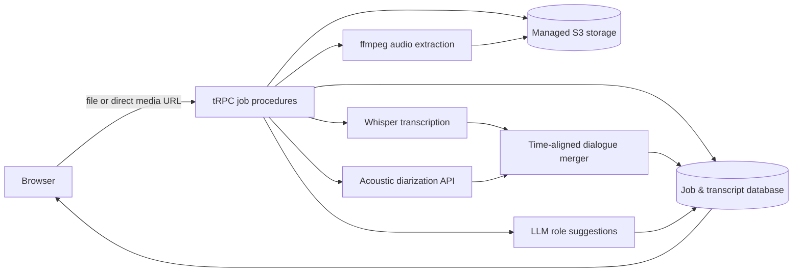

# Diarize: Serverless Transcription and Speaker-Diarization Design

**Status:** Approved design; implementation has not begun.

## 1. Purpose and scope

Diarize is a premium browser application for turning a local audio/video file or a **direct public HTTPS URL to an audio/video file** into a readable dialogue. The dialogue identifies acoustically distinct speakers, starts with labels such as `Speaker 1`, supports safe renaming, can show or hide timestamps, and can be copied or downloaded as plain text.

The first release intentionally does **not** download media from web-page URLs such as YouTube, Vimeo, or social networks. Those sources require a separate extraction process and a persistent server, which conflicts with the selected free serverless deployment. This limitation must be explicit in the input help and validation error.

## 2. Product decisions

| Area | Approved decision |
| --- | --- |
| Media input | Local audio/video upload or a direct public HTTPS URL to a media file. |
| Video handling | Server-side `ffmpeg` extracts a compatible audio track before speech processing. |
| Transcription | Whisper supplies the canonical dialogue text and segment timestamps. |
| Diarization | A separately authenticated external acoustic service supplies speaker-labelled timing data. Deepgram is the initial provider. |
| Participant names | System defaults are exactly `Speaker 1`, `Speaker 2`, and so forth. Display names may be edited at any time. |
| AI help | A server-side LLM produces optional speaker-role suggestions using only the completed transcript. It does not claim to identify real people. |
| History | Jobs are isolated to the current browser session; no cross-session job list is promised. |
| Output | Dialogue display, optional timestamps, clipboard copy, and `.txt` export share one formatting function. |
| Hosting | Managed serverless deployment for the application. Processing is capped to fit request and memory limits. |

## 3. System architecture

The implementation will use the supplied React, TypeScript, Express, tRPC, Drizzle, and managed object-storage template. The browser never receives a transcription or diarization credential. Server procedures own every interaction with managed storage, Whisper, the diarization provider, and the LLM.

Each job stores an immutable source reference, current stage, progress information, timestamps, error text when applicable, the source S3 object key, an extracted-audio S3 object key, and the merged transcript result. Files reside in object storage; the database retains only metadata, structured text, and object keys.

## 4. Job lifecycle and serverless constraints

The UI creates a durable job record before file transfer or remote retrieval. It then surfaces these exact user-facing stages in sequence:

1. `uploading`
2. `extracting audio`
3. `transcribing`
4. `diarizing`
5. `complete` or `failed`

The browser polls a job-status procedure while the job is active. The backend advances a job through discrete bounded steps rather than retaining an in-memory queue or an uncontrolled background process. This provides a recoverable job reference and prevents one large media operation from holding a browser request open end-to-end. The implementation will serialize memory-intensive audio extraction and enforce documented limits for media size and duration, returning a clear validation message when a file cannot fit the serverless envelope.

The application will use a custom production image only to include `ffmpeg`; it will build the full React and server app, listen on the platform-provided port, and include no secrets in the image.

## 5. Media safety and acceptance

Direct URL ingestion accepts only `https:` URLs and rejects local addresses, credentials in URLs, non-public hosts, redirects to non-public targets, unsupported types, and responses exceeding the configured byte limit. The UI asks the submitter to confirm they are entitled to process the supplied material.

The first release will document its supported media formats. Audio received from a direct URL or a user file is persisted to object storage, then made available to downstream providers through a temporary server-side URL. Video is first converted to a compressed audio representation before submitting transcription work.

## 6. Transcript and speaker model

The application uses an internal speaker key that preserves the diarizer's numeric output and a separate editable display name. A merged turn contains:

| Field | Meaning |
| --- | --- |
| `startMs` / `endMs` | Inclusive dialogue timing in milliseconds. |
| `text` | Canonical text from Whisper. |
| `speakerKey` | Stable technical identifier from the diarization result. |
| `speakerName` | Display label, initially `Speaker N`. |
| `confidence` | Optional provider confidence retained for inspection, not prominently displayed. |

Whisper segment times and diarizer word/utterance times are aligned by temporal overlap. A segment is assigned to the speaker occupying the greatest overlap; adjacent segments with the same speaker are joined when the inter-segment gap is small. If a segment cannot be confidently aligned, it retains a deterministic default speaker rather than inventing an identity.

Deepgram documents acoustic speaker labels on individual words and utterance-level groupings, while its labels are numeric rather than names. The merger is therefore responsible for converting source labels such as `0` into the interface's initial `Speaker 1` display label. [1]

## 7. LLM speaker suggestions

The LLM receives the transcript text and existing technical speaker labels only. It returns constrained structured JSON containing an optional role label, a concise rationale, and a confidence qualifier for each speaker. It must not search for external information, make a factual identity claim, or overwrite a user-provided display name. The browser presents the suggestion as a reversible action, for example: `Speaker 1 → Interviewer`.

## 8. User experience and visual identity

The application is a focused workspace with three durable regions: a session-scoped history rail, a central intake/transcript canvas, and a contextual participant panel. It has explicit empty, in-progress, complete, and error states. The transcript panel supports keyboard-accessible timestamp visibility, copy, and text download actions.

The visual identity uses a warm cream field and precise low-contrast golden geometry: intersecting circles, a golden-ratio spiral, and proportion guides. These motifs remain decorative and never compete with content. Headlines use a bold dark-navy sans-serif; supporting copy uses muted gold. Layout alignment, measured whitespace, short motion, visible focus states, and high text contrast create the intended intellectual, restrained, high-end character.

## 9. Error handling

| Condition | User-facing behavior | Retention behavior |
| --- | --- | --- |
| Invalid direct URL | Explain that only a public direct HTTPS media URL is accepted. | Job remains as failed history item. |
| Oversized or long media | Explain the serverless limit and recommend shortening/compressing the file. | Source is not processed further. |
| Audio extraction failure | Identify incompatible or damaged media and offer retry with another source. | Preserve diagnostic stage and source metadata. |
| Whisper failure | Mark transcription stage failed without pretending a transcript exists. | Allow a bounded retry. |
| Diarization failure | Preserve the successful Whisper text but mark speakers unavailable. | Allow diarization retry where safe. |
| LLM suggestion failure | Leave manual renaming fully usable; suggestions are optional. | Do not alter transcript data. |

## 10. Verification strategy

Server modules must be designed for deterministic tests: URL safety checks, state-transition rules, overlap-based speaker alignment, initial speaker labels, rename application, text formatting with and without timestamps, and export output. Integration tests will use provider adapters with mocked network responses. Browser verification will cover local-file intake UI, direct-URL validation, stage display, rename behavior, timestamp toggling, copy/download controls, responsive layout, and screen-reader-visible labels.

## References

[1]: [Deepgram — Speaker Diarization](https://developers.deepgram.com/docs/diarization)

[2]: [Deepgram — Pre-Recorded Audio](https://developers.deepgram.com/docs/pre-recorded-audio)

[3]: [obra/superpowers — software development methodology](https://github.com/obra/superpowers)
